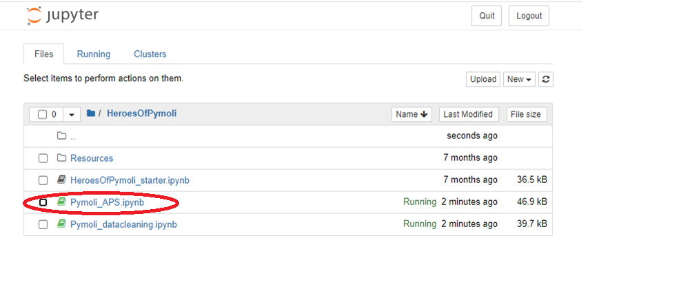

# Pandas-Challenge

## This contains an analysis of data provided for "Heroes of Pymoli." 
* The task was to analyze de-normalized purchase data for player demographics and purchase trends. 
* Jupyter notebook was used to track steps taken during data cleaning and analysis.

### Usage:
1. clone repository to local machine
2. launch jupyter notebook
3. open notebook for analysis

 

### Findings summarized below: 
1. Top 5 highest grossing, and top 5 most purchased, reflect the same top items. This suggests low variance over the purchase count by item distribution. This indicates price optimization across items, because mis-pricing would reveal differences between top 5 by revenue and top 5 most purchased, as very low priced items would rise in quantity purchased, while very high priced items would be purchased less frequently. 

2. Demographics show that most of the players are male. Age range distribution peaks over 15-25 years of age. This indicates the game appeals most to young male players. 

3. Total Revenue by age and gender reveal similar trends. This points to a low variance across avgerage revenue per player, regardless of demographic profile. This points to potential opportunity in attracting a larger following by increasing the appeal of the game to females or underrepresented age groups. These demographics would be the easiest to target, and since average revenue per player is very similar, would be the best way to grow revenue.  